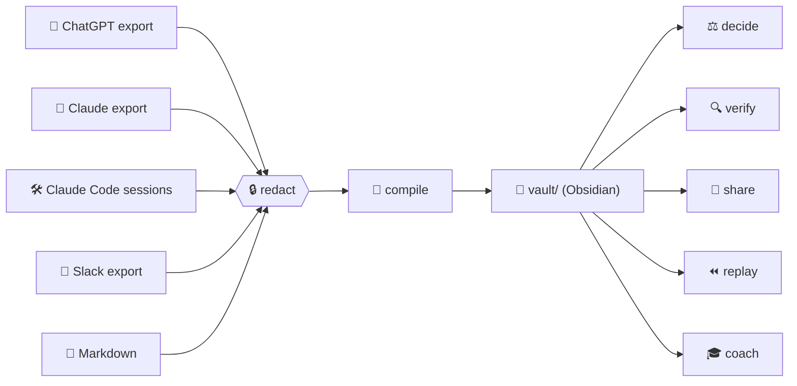

<p align="center">
  
</p>

<p align="center">
  <a href="https://github.com/mohitagw15856/afterthought/actions/workflows/ci.yml"></a>
  
  
  
  
  
</p>

<h3 align="center">Your AI chats are write-only. Let's fix that.</h3>

<p align="center">
  <a href="#-try-it-in-60-seconds">Quickstart</a> ·
  <a href="#-the-six-powers">The six powers</a> ·
  <a href="#-a-tour-of-the-demo">Demo tour</a> ·
  <a href="#-how-trust-works">How trust works</a> ·
  <a href="#-about">About</a> ·
  <a href="#-roadmap">Roadmap</a>
</p>

---

## 🫠 The problem

You ask an AI something genuinely clever. It gives you a great answer. You nod. You close the tab.

Three weeks later you are asking the same question again, because the answer, the reasoning, the tool it recommended, the decision you made on the back of it, and the assumption that decision quietly rested on... have all evaporated into a scrollback nobody will ever read.

Every tool on earth is racing to improve the **first half** of that journey: better prompts, bigger context, smarter retrieval, agents that click things. Almost nobody cares about the **second half**: keeping what you learned, knowing how much of it to trust, remembering what you decided, sharing it with your team, and actually getting better at this.

> **Afterthought is the second half.** 🌗

It turns your chats and agent runs into a wiki you can rely on. Plain markdown. One folder. Opens in Obsidian. No server, no database, no account, no vibes-based facts.



## ⚡ Try it in 60 seconds

No API key. No sign-up. The demo replays recorded model responses, so it runs on a plane.

```bash
git clone https://github.com/mohitagw15856/afterthought && cd afterthought
uv sync

uv run afterthought compile examples/chatgpt-export/conversations.json \
    --vault demo-vault --dry-run --fixtures examples/chatgpt-export/fixtures
```

You will see something like:

```
Inputs: conversations.json (chatgpt)
Conversations: 3 (3 with new material), new messages: 13, already processed: 0
Redactions applied: 2; model calls: 3
Pages written: 19, unchanged: 0, decisions staged: 4, questions: 1, unverified facts: 1
```

Now poke at it:

```bash
uv run afterthought status --vault demo-vault          # what is in here?
uv run afterthought decide list --vault demo-vault     # four decisions waiting for you
cat demo-vault/entities/people/siyu.md                 # meet Siyu
```

Open `demo-vault/` in Obsidian and hit the graph view. 🕸️

Run the compile a second time. It prints `No changes.` It already knows every message it has ever seen. Run it a hundred times. Still nothing. That is the point.

> [!TIP]
> Got a real export? `afterthought init --vault ~/vault --user "You"` then `afterthought compile ~/Downloads/conversations.json --vault ~/vault` with `ANTHROPIC_API_KEY` set. Every model response is cached, so re-runs are free.

## 🧰 The six powers

| | Power | What it actually does | Status |
|---|---|---|---|
| 🧠 | **compile** | Reads your exported chats and writes a wiki: one page per project, person, tool and concept, plus decisions, open questions and a day-by-day timeline. Only new messages get processed. Every model-written line cites its source. | ✅ shipped |
| ⚖️ | **decide** | A decision ledger. Choices spotted in your chats are staged for you to confirm. Each assumption gets a confidence and a check-by date, and `review` comes back later to ask: did it hold? | ✅ shipped |
| 🔍 | **verify** | Splits any model output into atomic claims and tags each one `SOURCED`, `INFERRED` or `UNVERIFIED`. Never invents a citation. `--demand` asks the model to show its evidence, claim by claim. | ✅ shipped |
| 🤝 | **share** | Publish chosen pages to a shared git repo with full provenance. Two people's pages on the same thing become a diff page, never a silent overwrite. `subscribe` pulls a teammate's pages read-only. | 🔜 next |
| ⏪ | **replay** | A flight recorder for agent runs. Step through a Claude Code session, diff two runs, see exactly which tool result sent things sideways. Static HTML, open it from disk. | 🗓️ planned |
| 🎓 | **coach** | Interviews you about your real work, builds a 30-day curriculum of concrete things to try with AI, and tracks progress in the wiki so compile knows what you have learned. | 🗓️ planned |

## 🎒 A tour of the demo

The bundled export is three fictional chats about **Lantern**, a home energy dashboard someone is building on a Raspberry Pi. It even contains a leaked email and an API key, on purpose, so you can watch them get scrubbed before any model sees them.

### 👩‍⚖️ Meet Siyu

<details open>
<summary><code>demo-vault/entities/people/siyu.md</code></summary>

```markdown
---
id: siyu
title: Siyu
kind: person
sources:
  - file: conversations.json
    message_id: conv-lantern-01-m03
    date: '2026-03-04T09:20:00Z'
    span: 398c94ce04f9
provenance:
  origin: llm
  tool: afterthought.compile
---
# Siyu

## Facts
- A friend of the user from Beijing, China. ^at-llm-398c94ce04f9
- A lawyer who tinkers with home automation at weekends. ^at-llm-398c94ce04f9-2
- Suggested [[grafana|Grafana]] for the [[lantern|Lantern]] dashboard. ^at-llm-398c94ce04f9-3
- Her law firm's IT team uses [[grafana|Grafana]] annotations to mark deploys. ^at-llm-f8e9aa5dd34d
```

</details>

See those little `^at-llm-...` tails? Each one is an Obsidian block id that resolves, through the frontmatter, to the **exact file, message and timestamp** the fact came from. Link to a single fact from anywhere with `[[siyu#^at-llm-398c94ce04f9]]`.

### 🚨 The model made something up

One fact in the demo cites a message that does not exist. Here is what happens to it:

```markdown
- UNVERIFIED: The Home Mini provides 30-second data at no charge. ^at-unverified-adeeefe741
```

Kept, flagged, and left out of the sources. Nothing is dropped and nothing is guessed. Ever.

### ⚖️ A decision, and what it rested on

Compile found four decisions in the chats and staged them. Confirm one:

```bash
uv run afterthought decide confirm D-913ef655 --check-in 90 --confidence 0=0.9 --vault demo-vault
```

```
Confirmed D-913ef655: Where should Lantern's database and dashboard run: the home Raspberry Pi or a VPS?
  check by 2026-06-13: A small VPS costs under 5 pounds a month
  check by 2026-06-13: The Pi collector can buffer a day of readings on its SD card
```

Ninety days later, `afterthought decide review` taps you on the shoulder:

```
2 assumption(s) due as of 2026-06-14:

D-913ef655  Where should Lantern's database and dashboard run: the home Raspberry Pi or a VPS?
  [0] A small VPS costs under 5 pounds a month  (confidence 0.90, due 2026-06-13 (1 days ago))
  Did it hold? [y]es / [n]o / [u]nknown / [s]kip: y
  Note: invoice was 4.20
  recorded: held
```

And the page remembers:

```markdown
## Assumptions
- [x] A small VPS costs under 5 pounds a month (confidence 0.90, check by 2026-06-13, checked 2026-06-14) Note: invoice was 4.20
- [ ] The Pi collector can buffer a day of readings on its SD card (confidence 0.50, check by 2026-06-13)
```

Decisions you have never revisited are just guesses with good posture. This fixes that.

### 🔍 Fact-check an answer against your own vault

`examples/verify/lantern-answer.md` is a plausible-sounding paragraph about Lantern. Some of it is true, some of it is a stretch, and some of it is invented. Ask verify:

```bash
uv run afterthought verify examples/verify/lantern-answer.md --vault demo-vault \
    --dry-run --fixtures examples/chatgpt-export/fixtures --demand --show
```

```
Claims: 7  SOURCED 3  INFERRED 2  UNVERIFIED 2
  [0] SOURCED    Lantern reads an Octopus Home Mini smart meter every 30 seconds. -> [[entities/projects/lantern#^at-llm-63e59f1f9ac6-2]]
  [3] INFERRED   Siyu is a lawyer from Beijing. -> Evidence says Siyu is a friend from Beijing, China and separately that she is a lawyer...
  [5] UNVERIFIED The VPS costs 4 pounds a month.
  [6] UNVERIFIED InfluxDB was rejected because it cannot store more than a year of data.
```

And the annotated copy reads like a marked essay:

```markdown
Lantern reads an Octopus Home Mini smart meter every 30 seconds. [SOURCED: [[entities/projects/lantern#^at-llm-63e59f1f9ac6-2]]]
Siyu is a lawyer from Beijing. [INFERRED] The VPS costs 4 pounds a month. [UNVERIFIED]
```

Every `SOURCED` tag links to a block in your vault, which links to a message in your export. The model never writes a citation; it can only point at evidence Afterthought handed it, and an index that does not exist is thrown away.

## 🛡️ How trust works

Afterthought has one rule, and everything else falls out of it:

> [!IMPORTANT]
> **A line is either traceable to a source, or it says UNVERIFIED.**

| 🔎 Guarantee | How |
|---|---|
| Every model-written line has a source | `^at-llm-<span>` block ids resolve through frontmatter to file, message id and date |
| Human lines are distinguishable | They carry no tag, and pages you record by hand have `origin: human` |
| Re-runs are byte-identical | Dates come from your sources, never the clock; every list is sorted |
| Nothing costs you twice | Model responses are cached by input; the demo and the whole test suite run on recorded fixtures |
| Secrets never reach a model | Emails, API tokens and card numbers are redacted before extraction and again before every write |
| You control what is read | `.afterthoughtignore` uses gitignore syntax |

The full contract lives in [ARCHITECTURE.md](ARCHITECTURE.md).

## 📥 Supported inputs

| Source | Where to get it |
|---|---|
| 💬 ChatGPT | Settings → Data controls → Export. Point at `conversations.json`. |
| 💬 Claude.ai | Settings → Privacy → Export data. Point at `conversations.json`. |
| 🛠️ Claude Code | `~/.claude/projects/<project>/<session>.jsonl` |
| 📣 Slack | Workspace export folder (needs `channels.json` and `users.json`) |
| 📝 Markdown | Any `.md` with `**User:**` / `**Assistant:**` turns, or a whole file as one note |

Format is sniffed automatically. Use `--format` to insist.

## 🗂️ What the vault looks like

```
vault/
├── index.md                     ← generated home page
├── entities/
│   ├── projects/lantern.md
│   ├── people/siyu.md
│   ├── tools/grafana.md
│   └── concepts/time-series-downsampling.md
├── decisions/
│   ├── D-913ef655.md            ← confirmed
│   └── staged/D-031a0c70.md     ← waiting for you
├── questions/how-to-downsample-...md
├── timeline/2026-03-04.md
└── .afterthought/
    ├── state/compile.json       ← what has been processed
    └── cache/llm/               ← every model response, replayable
```

Everything is markdown or JSON. Git is the sync layer. Delete `.afterthought/` and you lose nothing but the cache.

## 💡 About

**Why this exists.** I kept noticing that my most useful thinking was happening in chat windows and then disappearing. Note-taking apps wanted me to write everything down twice. RAG tools wanted to re-read my chats every single time and still could not tell me which bits were made up. What I actually wanted was a wiki that wrote itself from conversations I was already having, told me honestly what it could not back up, and tapped me on the shoulder when a decision was due a second look. Nothing did that. So: the second half.

**What it is not.** Not a chat client. Not a prompt library. Not a vector database. It does not talk to a model unless you ask it to compile something, and when it does, everything it learned lands in plain files you own.

**The name.** An afterthought is the thing you think of after the conversation is over. Usually that is the important bit.

**The rules it lives by.**

1. 📄 Plain files. Markdown and JSON in one folder. Git is the sync layer.
2. 🧾 Provenance or nothing. No line pretends to be a fact without a source.
3. 🔁 Idempotent. Run anything twice and nothing changes.
4. 🔒 Private by default. Redaction runs before the model sees your data.
5. 🟣 Obsidian first. If it does not render there without plugins, it is a bug.
6. 🧪 Tests without keys. Fixtures are recorded once and replayed forever.

**Who.** Built by [Mohit](https://github.com/mohitagw15856), with Claude as a pair. MIT licence. Issues and pull requests very welcome.

## 🗺️ Roadmap

- [x] 🧠 compile: chat-to-wiki compiler with incremental state and provenance
- [x] ⚖️ decide: decision ledger, staged confirmations, assumption review
- [x] 🔍 verify: claim extraction and `SOURCED` / `INFERRED` / `UNVERIFIED` tagging, with `--demand`
- [ ] 🤝 share: git-based team mesh with diff pages and `subscribe`
- [ ] ⏪ replay: agent flight recorder with a static HTML viewer
- [ ] 🎓 coach: onboarding interview and 30-day curriculum

<details>
<summary>🎬 GIFs still to record</summary>

1. `docs/gifs/compile.gif`: compiling the demo and opening the vault in Obsidian.
2. `docs/gifs/provenance.gif`: clicking a `^at-llm-` block id through to its source.
3. `docs/gifs/idempotent.gif`: second run prints `No changes.`
4. `docs/gifs/decide-review.gif`: `decide review` walking through due assumptions.
5. `docs/gifs/verify.gif`: the claims table for a model answer.
6. `docs/gifs/replay.gif`: stepping through an agent run in the viewer.

</details>

## 🔧 Development

```bash
uv sync
uv run pytest                 # fixtures only, no network
uv run pytest --live          # also hits Anthropic (needs ANTHROPIC_API_KEY)
uv run ruff check src tests
```

Commands, vault layout and schemas: [ARCHITECTURE.md](ARCHITECTURE.md) · per-module docs: [docs/](docs/) · how to help: [CONTRIBUTING.md](CONTRIBUTING.md)

<p align="center">
  <sub>Made for people who would like their conversations to add up to something. 🌗</sub>
</p>
