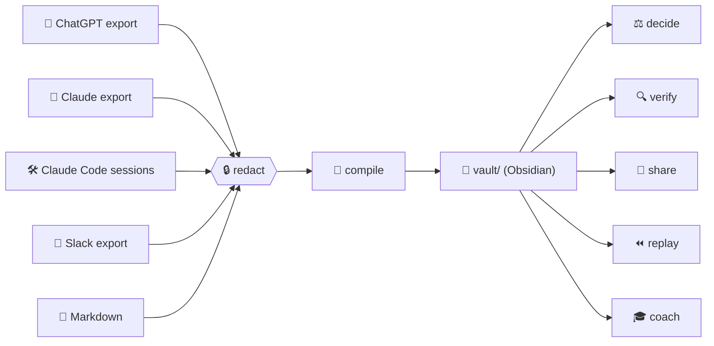

<p align="center">
  
</p>

<p align="center">
  <a href="https://github.com/mohitagw15856/afterthought/actions/workflows/ci.yml"></a>
  <a href="https://github.com/mohitagw15856/afterthought/releases"></a>
  
  
  
  
  
</p>

<h3 align="center">Your AI chats are write-only. This is the read side.</h3>

<p align="center">
  <a href="#-sixty-seconds-no-key-no-sign-up">Try it</a> ·
  <a href="#-the-six-powers">Six powers</a> ·
  <a href="#-meet-the-cast">The cast</a> ·
  <a href="#-a-day-in-the-life">Walkthrough</a> ·
  <a href="#-things-it-refuses-to-do">Refusals</a> ·
  <a href="#-questions-people-ask">FAQ</a> ·
  <a href="#-about">About</a>
</p>

---

## 🫠 Tuesday, 4:12 pm

You ask an AI something genuinely hard. It thinks. It answers. The answer is *good*. You say "great, thanks" to a computer, close the tab, and get on with your afternoon.

Three weeks later you are typing the same question again, slightly worse, because:

- the answer is somewhere in a scrollback nobody will ever read,
- you cannot remember which half of it was actually true,
- you made a decision because of it and the reason has evaporated,
- your teammate asked the same thing yesterday and got a different answer,
- and the agent run that "fixed the test" fixed a different test.

Every tool on earth is racing to improve the **first half** of that journey: better prompts, bigger context, smarter retrieval, agents that click buttons. Almost nobody cares about the **second half**: keeping what you learned, knowing how much of it to trust, remembering what you decided, sharing it with the humans you work with, and getting better at the whole business.

> **Afterthought is the second half.** 🌗
>
> Chats and agent runs go in. A wiki you can actually rely on comes out. Plain markdown, one folder, opens in Obsidian. No server, no database, no account, no vibes-based facts.



## ⚡ Sixty seconds, no key, no sign-up

The demo replays recorded model responses, so it runs on a plane, in a tunnel, or on a laptop whose owner has opinions about API keys.

```bash
git clone https://github.com/mohitagw15856/afterthought && cd afterthought
uv sync                      # or, without the demo: pip install afterthought-cli

uv run afterthought compile examples/chatgpt-export/conversations.json \
    --vault demo-vault --dry-run --fixtures examples/chatgpt-export/fixtures
```

```
Inputs: conversations.json (chatgpt)
Conversations: 3 (3 with new material), new messages: 13, already processed: 0
Redactions applied: 2; model calls: 3
Pages written: 19, unchanged: 0, decisions staged: 4, questions: 1, unverified facts: 1
```

Nineteen pages, four decisions waiting for your signature, one open question, and one fact the model made up that got caught at the door. Now:

```bash
uv run afterthought decide list --vault demo-vault     # the four decisions
cat demo-vault/entities/people/siyu.md                 # meet Siyu
```

Open `demo-vault/` in Obsidian and hit the graph view. 🕸️ Then run the compile again. It prints `No changes.` It will print `No changes.` forever. That is a feature, and there is a test for it.

> [!TIP]
> Real export? `afterthought init --vault ~/vault --user "You"`, set `ANTHROPIC_API_KEY`, then `afterthought compile ~/Downloads/conversations.json --vault ~/vault`. Every model response is cached, so nothing is ever paid for twice.

## 🧰 The six powers

| | Power | What it does, honestly | |
|---|---|---|---|
| 🧠 | **compile** | Reads your exported chats and writes a wiki: a page per project, person, tool and concept, plus decisions, open questions and a day-by-day timeline. Only new messages get processed. Every model-written line cites its source or admits it cannot. | ✅ |
| ⚖️ | **decide** | A decision ledger. Choices spotted in your chats are staged for you to confirm. Each assumption gets a confidence and a check-by date, and `review` comes back later to ask the awkward question: did it hold? | ✅ |
| 🔍 | **verify** | Splits any model output into atomic claims and stamps each one `SOURCED`, `INFERRED` or `UNVERIFIED`. It has never invented a citation and it is structurally unable to start. | ✅ |
| 🤝 | **share** | Publish chosen pages to a shared git repo with full provenance. Two people's pages on the same thing become a diff page, never a silent overwrite. `subscribe` pulls a teammate's pages in, read-only. | ✅ |
| ⏪ | **replay** | A flight recorder for agent runs. Step through a Claude Code session, diff two runs, and see exactly which tool result sent one of them sideways. Static HTML, opens from disk. | ✅ |
| 🎓 | **coach** | Interviews you about your real work, builds a 30-day curriculum of things to try with AI on your own documents, and writes what you have learned back into the wiki. | ✅ |

## 🎭 Meet the cast

Everything in the demo is fictional. It is also oddly relatable.

| | Who | Role in the story |
|---|---|---|
| 🏮 | **Lantern** | A home energy dashboard someone is building on a Raspberry Pi. Reads a smart meter every 30 seconds. Has Opinions about time-series storage. |
| 👩‍⚖️ | **Siyu** | A commercial lawyer from Beijing who tinkers with home automation at weekends. Suggested Grafana. Does not trust AI, because it once invented a clause number at her. |
| 🐙 | **The Octopus Home Mini** | The smart meter. Subject of the one fact in the demo that the model made up. Caught. Marked `UNVERIFIED`. Never forgiven. |
| 🔑 | **A leaked API key** | Pasted into a chat by accident, as one does. Redacted before any model ever sees it. Also a fake email. Both sleep with the fishes. |
| 🤖 | **Two agent runs** | Asked to fix the same failing test. One fixes it. The other spends its whole turn installing `numpy`. The diff knows why. |

## 🎒 A day in the life

### 1. Compile the chats


Siyu's page, straight out of the compiler:

```markdown
# Siyu

## Facts
- A friend of the user from Beijing, China. ^at-llm-398c94ce04f9
- A lawyer who tinkers with home automation at weekends. ^at-llm-398c94ce04f9-2
- Suggested [[grafana|Grafana]] for the [[lantern|Lantern]] dashboard. ^at-llm-398c94ce04f9-3
- Her law firm's IT team uses [[grafana|Grafana]] annotations to mark deploys. ^at-llm-f8e9aa5dd34d
```

Those `^at-llm-...` tails are Obsidian block ids. Each one resolves, through the page's frontmatter, to the **exact file, message and timestamp** the fact came from. Link to a single fact from anywhere with `[[siyu#^at-llm-398c94ce04f9]]`.

<details>
<summary>🧾 Watch a block id resolve to its source</summary>


</details>

### 2. The model makes something up

One fact in the demo cites a message that does not exist. Here is its fate:

```markdown
- UNVERIFIED: The Home Mini provides 30-second data at no charge. ^at-unverified-adeeefe741
```

Kept, flagged, and left out of the sources. Nothing is dropped. Nothing is guessed. Ever.

### 3. Run it again


Same input, zero model calls, zero changes. The ledger in `.afterthought/state/` remembers every message it has ever processed. Add a fourth conversation to the export and exactly one model call happens.

### 4. Sign a decision, then get asked about it later

Compile found four decisions in the chats and staged them. Confirm one and every assumption gets a check-by date:


Ninety days later `afterthought decide review` taps you on the shoulder, asks whether each assumption held, and writes your answer into the page:

```markdown
## Assumptions
- [x] A small VPS costs under 5 pounds a month (confidence 0.90, check by 2026-06-13, checked 2026-06-14) Note: invoice was 4.20
- [ ] The Pi collector can buffer a day of readings on its SD card (confidence 0.50, check by 2026-06-13)
```

Decisions you never revisit are guesses with good posture. This fixes that.

### 5. Fact-check an answer against your own vault

`examples/verify/lantern-answer.md` is a plausible paragraph about Lantern. Some of it is true, some is a stretch, some is invented.


```
Claims: 7  SOURCED 3  INFERRED 2  UNVERIFIED 2
  [0] SOURCED    Lantern reads an Octopus Home Mini smart meter every 30 seconds. -> [[entities/projects/lantern#^at-llm-63e59f1f9ac6-2]]
  [3] INFERRED   Siyu is a lawyer from Beijing. -> Evidence says Siyu is a friend from Beijing, China and separately that she is a lawyer...
  [5] UNVERIFIED The VPS costs 4 pounds a month.
  [6] UNVERIFIED InfluxDB was rejected because it cannot store more than a year of data.
```

With `--demand`, the model is handed a numbered list of evidence from your vault and may only point at an index. It never writes a citation. An index that does not exist is thrown away and the claim stays `UNVERIFIED`. There is a test with a deliberately lying provider to prove it.

### 6. Share it with the team, without a server

```bash
uv run afterthought share init ~/team-wiki --vault demo-vault --user Mo
uv run afterthought share publish entities/projects entities/people --vault demo-vault
```

That is a git repo. Push it anywhere. A teammate runs `afterthought share subscribe <url>` and your pages appear under their `vault/shared/team/`, read-only, provenance intact. If Siyu publishes her own version of `lantern.md`, nothing is overwritten: her copy lands under `by/siyu/`, yours stays canonical, and `conflicts/entities/projects/lantern.md` shows the diff until one of you publishes a matching version.

### 7. Replay an agent run, then find out why the second one went wrong


```
8 difference(s); outcome differs. First diverges at tool result of bash differs (step 3 vs 3).
Likely cause of the different outcome: tool result of bash differs (step 3 vs 3)
```

Same prompt, same first command. In run B the test runner came back with `ModuleNotFoundError: numpy` instead of the real assertion, and the agent spent its turn installing packages. Open `runs/<a>__vs__<b>/diff.html` from disk to step through both side by side.

### 8. Thirty days of real tasks, not tutorials

Siyu has never used AI for work. `examples/coach/answers.json` is her interview. The coach turns it into a month of tasks on her own documents, starting with redaction because she said confidentiality comes first:

```bash
uv run afterthought coach interview --answers examples/coach/answers.json --vault demo-vault --name Siyu
uv run afterthought coach plan --vault demo-vault --dry-run --fixtures examples/chatgpt-export/fixtures --start 2026-09-01
uv run afterthought coach done 3 --vault demo-vault --as-of 2026-09-03
```

```
- [x] Day 3: Ask for the summary again but tell the model to quote the clause number for every statement. Check each quote exists. [verify a claim against the source] (done 2026-09-03)
```

And now her person page has a `## Learned` section saying she can verify a claim against the source, dated, traced to the task that proved it. The wiki learns what you have learned.

## 🚫 Things it refuses to do

- **Invent a citation.** The model never writes one. It points at evidence Afterthought supplied, or the line says `UNVERIFIED`.
- **Present a date it did not read.** Every timestamp comes from your sources. The wall clock is only consulted when you mark something done today.
- **Call a model twice for the same input.** Responses are cached by input. The test suite runs on recorded fixtures with no key at all.
- **Overwrite a teammate.** Publishing writes under your own name. Disagreements become diff pages.
- **Show your secrets to a model.** Emails, API tokens and card numbers are redacted before extraction and again before every write. `.afterthoughtignore` handles the rest.
- **Need a server.** Or a database. Or an account. Or a build step. Or a plugin. `vault/` is markdown and JSON, and git is the sync layer.
- **Change anything on the second run.** Every command is idempotent, and `test_idempotent` will fight you about it.

## ❓ Questions people ask

**Is this a RAG thing?**
No. RAG re-reads your chats every time and still cannot tell you which bits were made up. Afterthought reads them once, writes what it learned to pages you own, and marks the parts it could not back up.

**Does it work offline?**
The demo and the whole test suite do. Compiling new material needs a model; everything after that is files on disk.

**Why markdown and not a database?**
Because you can open markdown in 2040. Because Obsidian, git, grep and your editor already understand it. Because a database is a server with extra steps.

**Which models?**
Anthropic through the official SDK by default. Any OpenAI-compatible endpoint, including local ones, via config. See [docs/llm-providers.md](docs/llm-providers.md).

**Is Siyu real?**
No. Neither is Lantern, the leaked key, or the agent that installed `numpy`. The relatability is real.

**Why "Afterthought"?**
An afterthought is the thing you think of after the conversation is over. Usually that is the important bit.

## 🔩 Under the bonnet

```
vault/
├── index.md                     ← generated home page
├── entities/
│   ├── projects/lantern.md
│   ├── people/siyu.md           ← gets a "Learned" section from coach
│   ├── tools/grafana.md
│   └── concepts/time-series-downsampling.md
├── decisions/
│   ├── D-913ef655.md            ← confirmed
│   └── staged/D-031a0c70.md     ← waiting for you
├── questions/
├── timeline/2026-03-04.md
├── claims/lantern-answer.claims.md
├── runs/fix-test-run-a-bfbc88f0/viewer.html
├── coach/curriculum.md
├── shared/team/                 ← read-only mirror of a teammate's repo
└── .afterthought/
    ├── state/compile.json       ← what has been processed
    └── cache/llm/               ← every model response, replayable
```

The one rule everything hangs off:

> [!IMPORTANT]
> **A line is either traceable to a source, or it says UNVERIFIED.**

| Guarantee | Mechanism |
|---|---|
| Every model-written line has a source | `^at-llm-<span>` block ids resolve through frontmatter to file, message id and date |
| Human lines are distinguishable | They carry no tag; pages you record by hand have `origin: human` |
| Re-runs are byte-identical | Dates come from sources; lists are sorted; unchanged files are never rewritten |
| Nothing costs twice | Responses cached by `(task, key)`; a missing fixture in dry-run is an error, never a guess |
| Secrets never reach a model | Redaction before extraction and before every write |

Page schemas, the provenance model and the full layout: [ARCHITECTURE.md](ARCHITECTURE.md).

## 📥 What it can read

| Source | Where to find it |
|---|---|
| 💬 ChatGPT | Settings, then Data controls, then Export. Point at `conversations.json`. |
| 💬 Claude.ai | Settings, then Privacy, then Export data. Point at `conversations.json`. |
| 🛠️ Claude Code | `~/.claude/projects/<project>/<session>.jsonl` |
| 📣 Slack | Workspace export folder (needs `channels.json` and `users.json`) |
| 📝 Markdown | Any `.md` with `**User:**` / `**Assistant:**` turns, or a whole file as one note |
| 🤖 Any agent | Emit the five-field JSONL hook format and `replay` can record it. See [docs/replay.md](docs/replay.md). |

Formats are sniffed. `--format` if you want to insist.

## 💡 About

**Why this exists.** My most useful thinking kept happening in chat windows and then disappearing. Note-taking apps wanted me to write everything down twice. Retrieval tools wanted to re-read my chats every single time and still could not tell me which bits were made up. What I wanted was a wiki that wrote itself from the conversations I was already having, told me honestly what it could not back up, and tapped me on the shoulder when a decision was due a second look. Nothing did that. So: the second half.

**What it is not.** Not a chat client. Not a prompt library. Not a vector database. It does not talk to a model unless you ask it to compile something, and when it does, everything it learned lands in plain files you own.

**The rules it lives by.**

1. 📄 Plain files. Markdown and JSON in one folder. Git is the sync layer.
2. 🧾 Provenance or nothing. No line pretends to be a fact without a source.
3. 🔁 Idempotent. Run anything twice and nothing changes.
4. 🔒 Private by default. Redaction runs before the model sees your data.
5. 🟣 Obsidian first. If it does not render there without plugins, it is a bug.
6. 🧪 Tests without keys. Fixtures are recorded once and replayed forever.

**Who.** Built by [Mohit](https://github.com/mohitagw15856), with Claude as a pair. Released under the MIT licence. Issues and pull requests very welcome, especially real exports that break a parser.

## 🗺️ Where it is going

All six powers from the original brief shipped in 0.1.0. Ideas on the list, none promised:

- A fixed skill vocabulary for coach, so "summarise a document" and "summarising documents" stop being two skills.
- Fuzzy alignment in replay for long runs where tool arguments drift slightly.
- Indexing human-written lines on model-generated pages as evidence for verify.
- Thread awareness in the Slack parser.
- More exporters: Gemini, Cursor, Codex, whatever you use. Open an issue with a redacted sample.

## 🔧 Development

```bash
uv sync
uv run pytest                 # fixtures only, no network
uv run pytest --live          # also hits Anthropic (needs ANTHROPIC_API_KEY)
uv run ruff check src tests
scripts/record_gifs.sh        # re-record the GIFs (needs vhs)
```

Per-module docs live in [docs/](docs/). How to help: [CONTRIBUTING.md](CONTRIBUTING.md). What changed: [CHANGELOG.md](CHANGELOG.md).

<p align="center">
  <sub>Made for people who would like their conversations to add up to something. 🌗</sub>
</p>
